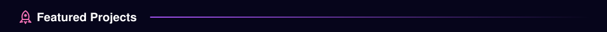
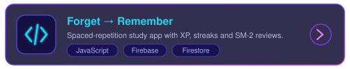
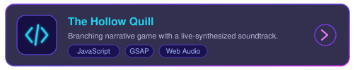
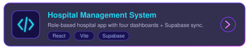
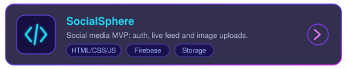

<!--
  This profile is drawn with generated SVGs (see /scripts/generate_profile.py).
  Edit text/links at the top of that script, then run it (or wait for the daily workflow).
-->

  
 

  

  
  

<!--
  Plain-text summary for screen readers and search:
  Shahmeer (ShahmeerNaseer) — Full-Stack Developer. Currently working on Hospital Management System; learning React.
  Stack: HTML, CSS, JavaScript, React, Vite, Firebase, Supabase, Git.
-->
